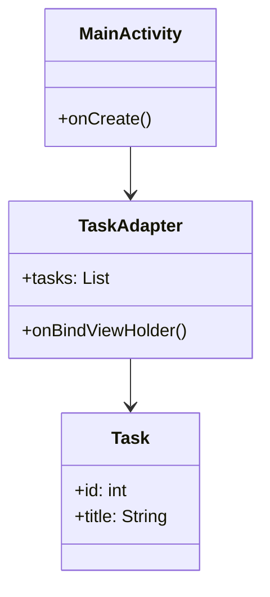
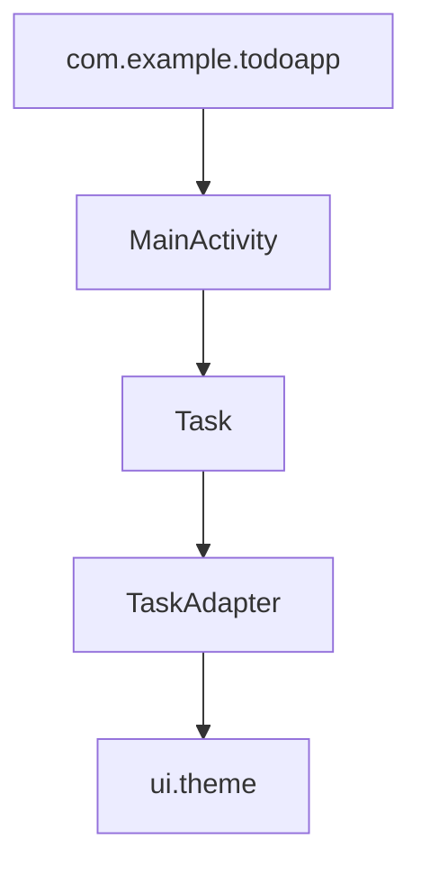
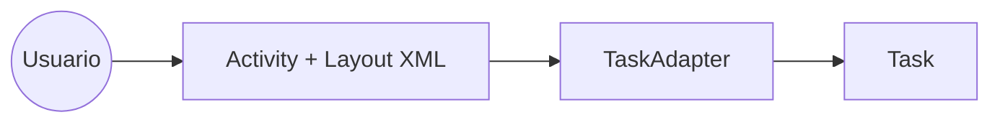
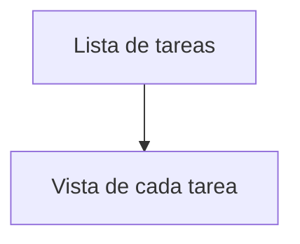

# ToDo App (Lista de Tareas)

> **Propósito**: Aplicación Android que permite gestionar una lista de tareas, mostrando y administrando elementos en una interfaz simple.
>
> **Estado**: `En desarrollo`  
> **APK**: 
> - Debug: `app/build/outputs/apk/debug/app-debug.apk`  
> - Release: `app/build/outputs/apk/release/app-release.apk`

---

## Tabla de contenido
- [Resumen del proyecto](#resumen-del-proyecto)
- [Cuestionario y respuestas](#cuestionario-y-respuestas)
- [Compilación y ejecución](#compilación-y-ejecución)
- [Pruebas](#pruebas)
- [Licencia](#licencia)

---

## Resumen del proyecto
**Descripción breve:** Aplicación Android nativa que gestiona tareas (ToDo App). El usuario puede visualizar, agregar y manipular tareas representadas en una lista.  
**Público objetivo:** Personas que necesitan organizar actividades diarias.  
**Stack usado:** Android Studio, Java, Kotlin (para temas visuales), Gradle, Android SDK.  
**Arquitectura usada:** Patrón MVC/Adapter, con separación entre modelo (`Task`), vista (`activity_main.xml`, `item_task.xml`) y controlador (`MainActivity`).

---

## Cuestionario y respuestas

### 1. Conceptos del componente formativo
La aplicación aplica los conceptos de arquitectura de software, patrones de diseño y buenas prácticas de desarrollo. Se identifican capas de presentación, lógica y datos.

---

### 2. Requerimientos del sistema
- **Android Studio:** Iguana 2023.2.1 o superior.  
- **JDK:** 17  
- **Gradle:** 8.x  
- **compileSdk:** 34  
- **minSdk:** 24  
- **targetSdk:** 34  

**Dispositivo de ejecución:** Android 7.0 o superior, con al menos 200 MB de espacio disponible.

---

### 3. Android Studio y SDK
El proyecto utiliza Gradle (Kotlin DSL) para gestión de dependencias y construcción. Los layouts están en XML, con temas definidos en Kotlin (`ui/theme`).

---

### 4. Diagrama de clases


---

### 5. Diagrama de paquetes


---

### 6. Diagrama de componentes


---

### 7. Capas y ubicación de componentes
- **Presentación:** `MainActivity`, layouts XML.  
- **Modelo:** `Task`.  
- **Adaptador (Controlador):** `TaskAdapter`.  
- **Tema/Estilos:** `ui/theme`.

---

### 8. Metodología de desarrollo
Se sugiere metodología **ágil** (Scrum/Kanban) con entregas incrementales, tablero de tareas y control de versiones con GitHub.

---

### 9. Mapa de navegación


---

### 10. Codificación por módulos
- **Lenguaje:** Java (clases principales), Kotlin (temas).  
- **Módulos:** `app` como módulo único del proyecto.

---

### 11. Control de versiones
- **Sistema:** Git en GitHub.  
- **Ramas recomendadas:** `main` (estable), `feature/*` (nuevas funcionalidades).  
- **Commits:** mensajes descriptivos y consistentes.

---

### 12. Librerías para la capa de presentación
- `appcompat`  
- `material`  
- `constraintlayout`

Estas librerías permiten el diseño y la interacción de la interfaz.

---

### 13. Frameworks a utilizar
La app no usa frameworks adicionales, pero puede extenderse con:
- **Persistencia:** Room Database.  
- **Red:** Retrofit (si en el futuro requiere conexión).

---

### 14. División en componentes reutilizables
Se puede dividir la UI en componentes XML reutilizables (`item_task.xml` para tareas repetidas). Los temas (`Theme.kt`) se aplican globalmente.

---

### 15. Buenas prácticas de codificación
- Métodos con nombres claros.  
- Clases separadas por responsabilidad (modelo, vista, adaptador).  
- Uso de adaptadores para listas dinámicas.

---

### 16. División del código fuente en paquetes
```
app/
 └─ src/main/java/com/example/todoapp/
     ├─ MainActivity.java
     ├─ Task.java
     ├─ TaskAdapter.java
     └─ ui/theme/
```

---

### 17. Patrones de diseño aplicados
- **Adapter Pattern:** en `TaskAdapter` para manejar listas.  
- **MVC:** separación entre modelo (`Task`), vista (`XML`), y controlador (`MainActivity`).

---

## Compilación y ejecución
- **Debug:** `Run ▶` en Android Studio sobre el módulo `app`.  
- **Generar APK:** `Build > Build APK(s)` → `app/build/outputs/apk/`.  

---

## Pruebas
- Pruebas unitarias en `androidTest/` con JUnit.  
- `ExampleInstrumentedTest` incluido como referencia.

---

## Licencia
Este proyecto es de uso académico y se distribuye bajo la licencia **MIT** (o la que se indique).

